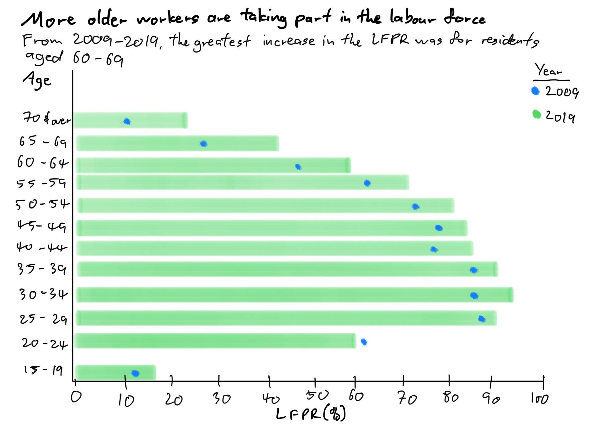
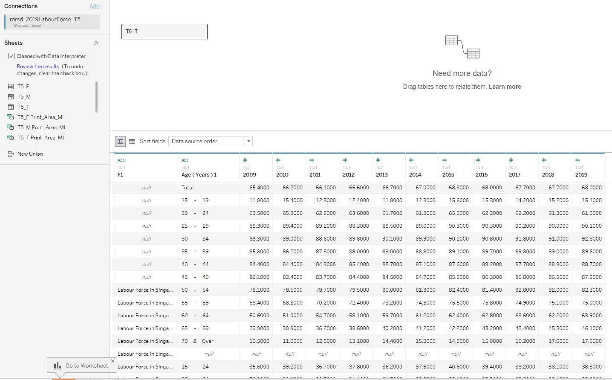
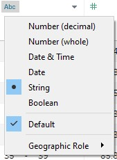

```{r setup, include=FALSE}
knitr::opts_chunk$set(echo = FALSE)
```

# 1.0 Overview

Data Visualisation on Tableau Public: (https://public.tableau.com/views/DataVizMakeover1_16116436098390/LFPR2009-2019)

### 1.1 Clarity vs aesthetics

In terms of aesthetics, the chart provided in the DataViz Makeover 1 assignment looks acceptable. Font styles and colour schemes are easy on the eyes.

However, the presentation of the data itself is not clear. Based on this, the chart falls into Quadrant IV of the matrix:

{width=100%}

# 2.0 Makeover
### 2.1 Critique of the visualisation, and suggested improvements
#### **2.1.1 Clarity**
S/n | Critique | Suggestions for improvement
- | ------ | ------
1 | _Unclear subtitle_. It is not clear what the subtitle "Per Cent" refers to. It almost looks to be put there as an afterthought. | _Remove the subtitle_ and label the appropriate axis with “%”. This will eliminate uncessary text, yet present the percentage values in a more intuitive manner.
2 | _The x-axis is not explained_. There are no labels to explain what the three types of values on the x-axis mean. | _Pivot the data_ such that the percentages are on the x-axis and the age group is on the y-axis, and label the axes accordingly. This will improve the clarity of the visualisation.
3 | _Age Group is not presented clearly_. It would be clearer if percentage was presented on the y-axis instead of the x-axis, as the x axis is typically for presenting time period. Together with the blue and grey lines of the line graph, it looked as though a timeline was being presented. Only upon further examination was it understood to be for presenting age proportion in percentage. | _Pivot the data_ such that age group is presented on the y-axis. This will improve the intuition of the visualisation.
4 | _Duplicate presentation of information_. The two lines of the line graph essentially present the same information as the percentage values in the a-axis. The line graph presented the trend visually, while the x-axis provided the actual percentage values. This duplication would not be needed with better visualization design. | _Remove the June 2009 and June 2019 percentage values on the x-axis_. This will no longer be necessary once the data is presented appropriately.

#### **2.1.2 Aesthetics**
S/n | Critique | Suggestions for improvement
- | ------ | ------
1 | _Good use of colour to differentiate the two time periods_. A more contrasting colour scheme might be better. | _Use more appealing colours_ to enhance the contrast and clarity of the two sets of data being compared.
2 | _Clear labeling_ of what the two lines in the line graph represent, and the median ages. However, better designed aesthetics could allow for more concise labeling (using less words). | _Include labels_ as necessary.
3 | With thee different values, the _x-axis is too cluttered_. | This will be solved once the data is _pivoted appropriately_, as mentioned above.
4 | A minor point: although best practice states that number ranges should start from 0, there is no need for the age group to start from 0 in this case, as this graph is meant to present the labour force which is consists of only persons aged 15 years and over (https://stats.mom.gov.sg/SL/Pages/Labour-Force-Introduction.aspx). The age groups presented covers the entire range of legal working age ranges. | No action necessary.

### 2.2 Sketch of the alternative visualisation

The sketch below is the proposed improved visualisation to address the critique presented above.</br>

{width=100%}

### 2.3 Building the visualisation

This visualisation was built using [Tableau Desktop Professional Edition 2020.4.0](httpshttps://www.tableau.com/products/desktop).

S/n | Step | Action
- | --- | ------
1 | Import data into Tableau | Import Excel file into Tableau.</br>{width=100%}
2 | Clean the data | The data is not standardised and clean because the formatting of the spreadsheet is not friendly for data importation.</br>{width=100%}
3 | Clean the data | Click on the “Cleaned with Data Interpreter” to provide an initial clean-up of the data and allow for easier manual cleaning.</br>{width=100%}
4 | Clean the data | Hide the left-most column as it is not useful for this analysis.</br>{width=75%}
5 | Clean the data | Rename the “Age (Years) 1” column to “Age Group” for clarity.</br>{height=75%}
6 | Clean the data | Check that the “Age” column is of the correct data type _(String)_.</br>{width=60%}
7 | Clean the data | Check that the rest of the year columns are of the correct data type _(Number[decimal])_.</br>{width=100%}
8 | Build the visualisation | Drag "2009" and "2019" to the Columns pane.
9 | Build the visualisation | Drag "Age Group" to the Rows pane.</br>{width=100%}
10 | Build the visualisation | Exclude the "NULL" and "Total" columns from the chart as these are not useful for the analysis.
11 | Build the visualisation | Exclude the overlapping age groups, as these will confuse the data presented in the visualisation.</br>{width=75%}
12 | Build the visualisation | Sort "Age Group" in descending order.
13 | Build the visualisation | Select "Dual Axis" to combine the two charts into one.</br>{width=75%}
14 | Build the visualisation | Select "Synchronise Axis" to ensure both charts' axes match.</br>{width=75%}
15 | Build the visualisation | Remove "Show Header" to show only one y-axis.</br>{width=75%}
16 | Build the visualisation | Change the 2019 Mark to Bar chart.</br>{width=75%}
17 | Build the visualisation | Swap "SUM(2019)" to the front of the Columns pane to display the 2019 chart behind the 2009 chart.</br>{width=100%}
18 | Build the visualisation | Edit the range of the x-axis to show the whole range of 0% to 100%. Rename label as "LFPR (%)".</br>{width=100%}
19 | Build the visualisation | Change the view to "Entire View" for visual clarity.</br>{width=60%}
20 | Build the visualisation | Edit the chart title.</br>{width=100%}
21 | Build the visualisation | Edit the Legend title to "Year".</br>{width=75%}
22 | Build the visualisation | Rename the Sheet.</br>{width=100%}
23 | Build the visualisation | The completed chart looks like this:</br>{width=100%}

### 2.4 Some key observations from the visualisation
S/n | Observation
- | ------
1 | The 25 to 29 age group had the highest LFPR in 2009. Ten years later in 2019, the age group with the highest LFPR was 30 to 34.
2 | The largest increase in LFPR from 2009 to 2019 is amongst the 50 to 64, and 65 to 69 age groups. This is expected of a an [ageing population](https://stats.mom.gov.sg/Pages/Labour-Force-In-Singapore-2019.aspx).
3 | Of all the LFPR age groups, only the 20 to 24 age group declined in LFPR from 2009 to 2019. This is the only exception amongst all the LFPR age groups.
4 | 4.	The lower the age group, the lower the increase in LFPR from 2009 to 2019, with the exception of the 15 to 19 age group, which seemed to reverse the trend compared to the next older age group. This seems to contradict Singapore’s Total Fertility Rate (TFR) which [has been declining](https://www.singstat.gov.sg/modules/infographics/total-fertility-rate) consistently, but may have been bolstered by the slight up-tick in TFR in 2000.

Thank you for visiting my blog!

<font size="2"> Distill is a publication format for scientific and technical writing, native to the web.</br>
Learn more about using Distill at <https://rstudio.github.io/distill>. </font>


